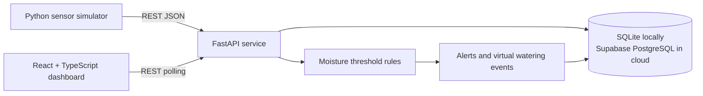
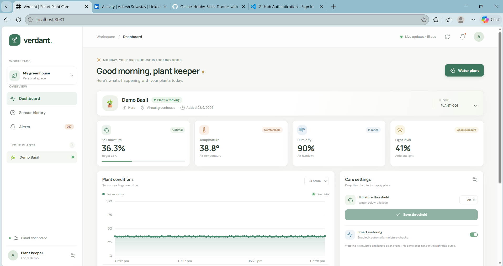

# 🌱 Cloud-Connected Smart Plant Care & Watering System

[](docs/cloud-deployment.md)
[](https://fastapi.tiangolo.com/)
[](https://react.dev/)
[](https://supabase.com/)
[](https://docs.docker.com/compose/)

> **Course:** Cloud Computing · **Project:** IoT-based plant monitoring and virtual watering · **Deployment:** Local Docker Compose, with optional Render and Supabase cloud services

## 📌 Executive Summary

Plant care can be difficult to manage consistently, especially when growing conditions are not visible remotely. This project demonstrates an IoT-to-cloud workflow that simulates plant sensor readings, sends them to a REST API, stores time-series data, and evaluates moisture thresholds. A React dashboard presents current conditions, history, alerts, and virtual watering activity.

The complete demo runs locally without physical hardware. SQLite is used by default, and Supabase-hosted PostgreSQL is available for cloud persistence.

> **Demo scope:** Sensor readings are synthetic and watering actions are virtual. The application does not control a physical pump.

## ☁️ Cloud Architecture



### Cloud service mapping

| Layer | Local demonstration | Cloud option |
| --- | --- | --- |
| Dashboard | React app served through Docker/Nginx | Render static site |
| API | FastAPI container | Render Docker web service |
| Database | SQLite with a persistent Docker volume | Supabase managed PostgreSQL |
| Sensor input | Python simulator | Simulator or a future ESP32 client |
| Actuation | Virtual watering records only | No physical pump integration is included |

The browser communicates with FastAPI; database credentials remain on the server side. The cloud database is optional, and the local setup does not require a cloud account.

## 🚀 Key Features

- Synthetic soil moisture, temperature, humidity, and light readings
- Simulator that registers a demo device and retries transient API requests
- Versioned FastAPI endpoints with request validation and interactive OpenAPI documentation
- SQLite persistence locally and optional Supabase PostgreSQL persistence
- Configurable moisture threshold with automatic rule evaluation
- Alert and virtual watering-event history
- Responsive React and TypeScript dashboard with selectable sensor history
- Docker Compose services for the API, dashboard, and simulator
- GitHub Actions checks for backend tests and frontend production build
- Documented path for a future ESP32 and sensor extension

## 📸 Project Screenshots

### Dashboard Overview

The dashboard brings together plant status, live sensor metrics, moisture history, care settings, alerts, and virtual watering activity.



The image is a local demo populated by the running API and simulator.

## 🧰 Technology Stack

| Area | Technologies |
| --- | --- |
| Backend API | Python 3.12+, FastAPI, Pydantic, SQLAlchemy |
| Frontend | React 18, TypeScript, Vite, Recharts, Lucide |
| Data | SQLite locally; Supabase PostgreSQL optionally |
| Runtime and web serving | Docker Compose, Docker, Nginx |
| Testing and automation | pytest, TypeScript build checks, Vite production build, GitHub Actions |

## 📦 Quick Start: Docker

### Prerequisites

- Docker Desktop with Docker Compose enabled

### Start the application

Run these commands from the repository root in PowerShell:

```powershell
Copy-Item .env.example .env
docker compose up --build
```

Open the local services:

- **Dashboard:** [http://localhost:8081](http://localhost:8081)
- **Interactive API documentation:** [http://localhost:8000/docs](http://localhost:8000/docs)
- **API health check:** [http://localhost:8000/api/v1/health](http://localhost:8000/api/v1/health)

The simulator registers `PLANT-001` and sends a reading every 10 seconds. Data is stored in the named `plant-data` Docker volume. Press `Ctrl+C` to stop Compose; `docker compose down` stops services while preserving data. `docker compose down -v` also removes the local database volume.

## 🖥️ Run Without Docker

### Start the backend

```powershell
cd backend
py -m venv .venv
.\.venv\Scripts\Activate.ps1
pip install -r requirements.txt
python -m app.main
```

### Start the React dashboard

In a second terminal:

```powershell
cd frontend\react-app
npm ci
& .\node_modules\.bin\vite.cmd --host 0.0.0.0
```

Open the Vite URL shown in the terminal, normally [http://localhost:5173](http://localhost:5173). Vite proxies `/api` requests to `http://localhost:8000`.

### Start the sensor simulator

In a third terminal, from the repository root:

```powershell
py -m pip install httpx
py simulator\sensor_simulator.py --interval 10
```

The simulator registers `PLANT-001` on its first run. Add `--device-id PLANT-002` to register another virtual plant. Use `--offline` to generate local log output without an API.

The legacy static dashboard is also available at [frontend/index.html](frontend/index.html). To serve it, run `py -m http.server 8080` from the `frontend` directory and open [http://localhost:8080](http://localhost:8080). The React dashboard is the recommended interface.

## 🗄️ Supabase Cloud Database

Supabase provides managed PostgreSQL storage while FastAPI remains the trusted API layer. The browser does not connect directly to Supabase.

1. Create a Supabase project and open **SQL Editor**.
2. Run [`supabase/schema.sql`](supabase/schema.sql) to create the tables and indexes.
3. Copy the PostgreSQL connection URL from **Project Settings → Database**. Use the TLS-enabled connection details and the session pooler when required by the hosting provider.
4. Store the URL in a private root `.env` file as `DATABASE_URL`. Set `CORS_ORIGINS` to the exact dashboard origin. Do not commit `.env`.
5. Start the services with Docker Compose. The backend connects to PostgreSQL using the server-side URL.

For local SQLite, keep the example database URL in `.env`. See [`docs/cloud-deployment.md`](docs/cloud-deployment.md) for connection and deployment details.

## 🌐 Render Deployment

The [`verdant.yaml`](verdant.yaml) Blueprint defines a Docker API service and a static React dashboard. Configure these values in Render's environment settings before deploying:

- API `DATABASE_URL`: Supabase PostgreSQL connection URL with TLS
- API `CORS_ORIGINS`: exact deployed dashboard origin
- Dashboard `VITE_API_BASE_URL`: deployed API origin followed by `/api/v1`

Redeploy the dashboard after changing its build-time API URL. Verify the API at `https://<api-host>/api/v1/health`, then open the dashboard URL. Never place database credentials in frontend variables. Full instructions are in [`docs/cloud-deployment.md`](docs/cloud-deployment.md).

## 📡 REST API

Interactive OpenAPI documentation is available at `/docs` while the backend is running.

| Method | Route | Purpose |
| --- | --- | --- |
| `GET` | `/api/v1/health` | Check API liveness |
| `GET`, `POST` | `/api/v1/devices` | List or register devices |
| `GET`, `PATCH` | `/api/v1/devices/{device_id}` | Read or update plant metadata and threshold |
| `POST` | `/api/v1/sensor-readings` | Submit a validated sensor reading |
| `GET` | `/api/v1/sensor-readings/{device_id}?limit=100` | Read sensor history |
| `GET`, `POST` | `/api/v1/watering-events/{device_id}` | Read or create virtual watering events |
| `GET` | `/api/v1/alerts/{device_id}` | Read alerts |
| `GET` | `/api/v1/dashboard/{device_id}` | Read the dashboard summary |

## 🧪 Data Model and Watering Rule

The service stores device metadata, sensor readings, watering events, and alerts. Sensor input is validated by the API.

```json
{
  "device_id": "PLANT-001",
  "soil_moisture": 32,
  "temperature": 29.4,
  "humidity": 61,
  "light_level": 72,
  "timestamp": "2026-09-28T12:00:00Z"
}
```

When automatic watering is enabled, a reading below the configured moisture threshold records the applicable decision, alert, and virtual event. No physical watering occurs.

## ✅ Tests and Quality Checks

Run the backend tests and frontend checks from the repository root:

```powershell
python -m pip install -r backend\requirements.txt
python -m pytest backend\tests
cd frontend\react-app
npm ci
node .\node_modules\typescript\bin\tsc -b
if ($?) { node .\node_modules\vite\bin\vite.js build }
```

Validate Docker Compose configuration with `docker compose config`. The CI workflow is in [`.github/workflows/ci.yml`](.github/workflows/ci.yml).

## 🔐 Security, Scope, and Limitations

- This is an educational demo, not a production-ready irrigation service.
- The API does not currently authenticate users or devices. Keep it local or behind a trusted access layer until authentication, authorization, rate limits, and device credentials are added.
- Treat `DATABASE_URL` as a server secret. Never expose it, a Supabase service-role key, or a database password in frontend `VITE_*` variables.
- Set `CORS_ORIGINS` to the exact dashboard origin. CORS is not an authentication mechanism.
- Use TLS for public traffic, configure database backups, and define data retention before collecting high-volume readings.
- The simulator and REST workflow use synthetic/demo values only.

## 🔌 Optional Hardware Extension

The simulator can be replaced by an ESP32 with a capacitive soil-moisture probe and a DHT22/SHT31 sensor using the same JSON API format. A physical relay or pump requires electrical isolation, a safe power supply, dry-run protection, and a hardware-side maximum run-time cutoff. Keep physical actuation disabled until independently validated.

## 🎓 Project and Portfolio Resources

- [Project report](docs/project-report.md)
- [Architecture overview](docs/architecture.md)
- [Cloud deployment guide](docs/cloud-deployment.md)
- [GitHub portfolio checklist](docs/github-portfolio.md)

For a portfolio repository, add a genuine dashboard screenshot, confirm the GitHub Actions workflow passes, and include the tags `iot`, `cloud-computing`, `fastapi`, `react`, `supabase`, and `docker`. Do not publish `.env`, database credentials, or real personal data.

## ⚖️ License

MIT. See [LICENSE](LICENSE).
