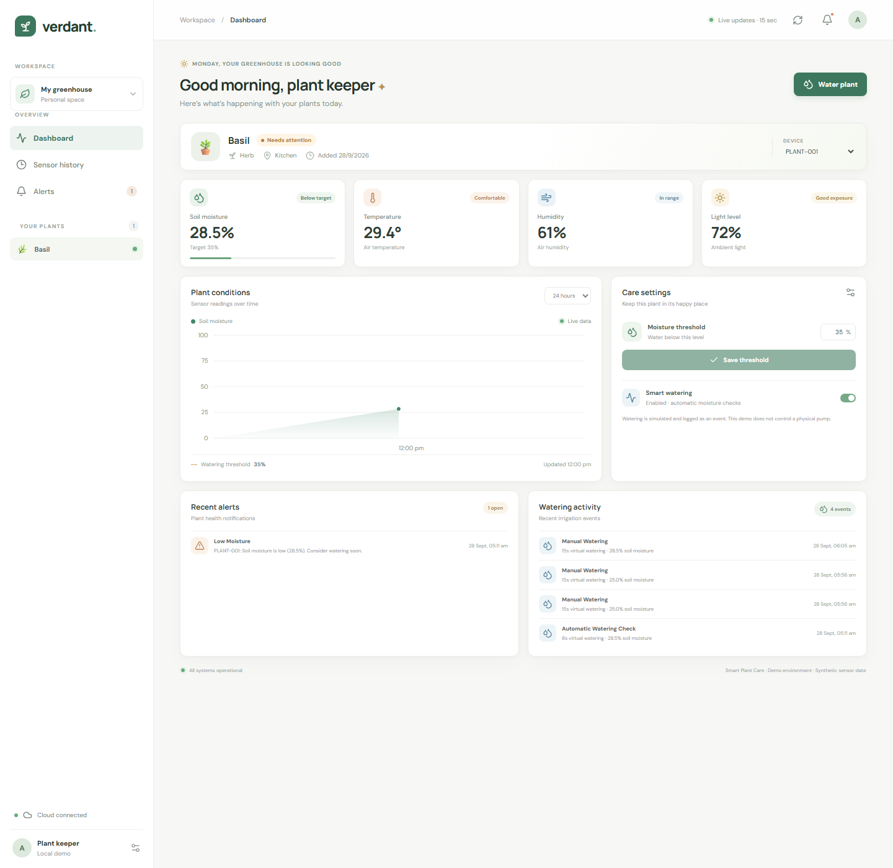
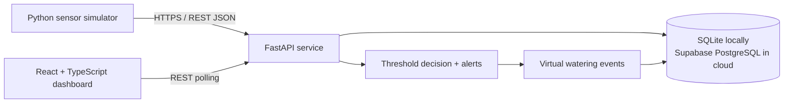

# Cloud-Connected Smart Plant Care & Watering System


A portfolio-ready IoT/cloud demo that simulates plant sensors, stores time-series readings, evaluates irrigation rules, and presents a remote monitoring dashboard. It runs locally without hardware and can use Supabase-hosted PostgreSQL when you want a cloud database.

> All readings and watering actions in the default setup are synthetic/virtual. No physical pump is controlled.

## Dashboard

The React dashboard includes plant/device selection, live metric cards, moisture history, threshold editing, automatic watering status, alerts, and watering-event history.



The screenshot above shows the local dashboard populated with synthetic readings from the running API.

## Architecture.    



## Features

- Configurable synthetic soil moisture, temperature, humidity, and light readings
- Retry-aware simulator that registers the demo device automatically
- FastAPI REST service with request validation and OpenAPI docs
- SQLite for local development; Supabase PostgreSQL for cloud persistence
- Moisture-based watering decisions and alert/event history
- Responsive React + TypeScript dashboard with a live-updating chart
- Adjustable plant moisture threshold
- Docker Compose deployment for API, dashboard, and simulator
- GitHub Actions checks for backend tests and frontend production build
- Optional ESP32/sensor extension path

## Quick start: Docker (recommended)

Requirements: Docker Desktop with Compose enabled.

```powershell
Copy-Item .env.example .env
docker compose up --build
```

Open:

- Dashboard: [http://localhost:8081](http://localhost:8081)
- API docs: [http://localhost:8000/docs](http://localhost:8000/docs)
- Health check: [http://localhost:8000/api/v1/health](http://localhost:8000/api/v1/health)

The simulator creates `PLANT-001`, sends a reading every 10 seconds, and writes to the named `plant-data` Docker volume. Stop with `Ctrl+C`; run `docker compose down` to stop services while preserving data. `docker compose down -v` also removes the local database volume.

## Deploy to Render

The [`verdant.yaml`](verdant.yaml) Blueprint creates a Docker API service and a static React dashboard. In Render's Blueprint form, enter `verdant.yaml` as the Blueprint path. Because the API needs persistent cloud storage, set up Supabase first, then deploy the Blueprint from your GitHub repository in Render:

1. Set the API service's `DATABASE_URL` to the Supabase PostgreSQL connection URL (use the TLS URL).
2. Set `CORS_ORIGINS` to the deployed dashboard URL, e.g. `https://smart-plant-dashboard.onrender.com`.
3. Set the dashboard's `VITE_API_BASE_URL` to the deployed API URL plus `/api/v1`, e.g. `https://smart-plant-api.onrender.com/api/v1`.
4. Redeploy the dashboard after setting its build-time environment variable.
5. Check `https://<api-host>/api/v1/health`, then open the dashboard URL.

Set these values in Render's environment-variable settings. Do not commit the Supabase connection URL to the repository or paste it into frontend variables. See [`docs/cloud-deployment.md`](docs/cloud-deployment.md) for Supabase setup and security details.

## Run without Docker

### Backend

```powershell
cd backend
py -m venv .venv
.\.venv\Scripts\Activate.ps1
pip install -r requirements.txt
python -m app.main
```

### React dashboard

Open a second terminal:

```powershell
cd frontend\react-app
npm ci
& .\node_modules\.bin\vite.cmd --host 0.0.0.0
```

Open the Vite URL printed in the terminal (normally [http://localhost:5173](http://localhost:5173)). Vite proxies `/api` requests to `http://localhost:8000`.

### Sensor simulator

Open a third terminal:

```powershell
py -m pip install httpx
py simulator\sensor_simulator.py --interval 10
```

The simulator registers `PLANT-001` on the first run. To generate local log output without an API, add `--offline`. Use `--device-id PLANT-002` to create another virtual plant.

The original static dashboard remains available at [frontend/index.html](frontend/index.html). To use it, serve the `frontend` directory with `py -m http.server 8080` from that directory and open [http://localhost:8080](http://localhost:8080). The React application is the recommended UI.

## Supabase cloud database

Supabase provides managed PostgreSQL storage; the FastAPI service remains the trusted API layer. The browser talks only to FastAPI, not directly to Supabase.

1. Create a Supabase project and open **SQL Editor**.
2. Run [`supabase/schema.sql`](supabase/schema.sql) to create the tables and indexes.
3. Copy the project’s PostgreSQL connection string from **Project Settings → Database**. Prefer the session pooler for app hosting where required, and use its TLS-enabled connection string.
4. Put it in a private root `.env` file. Do not commit that file:

   ```dotenv
   DATABASE_URL=postgresql://postgres.<project-ref>:<password>@<pooler-host>:5432/postgres?sslmode=require
   CORS_ORIGINS=https://your-dashboard.example
   ```

5. Start the app with Docker Compose. The backend normalizes `postgresql://` to the psycopg 3 driver and connects to Supabase. Keep the database password server-side and rotate it if exposed.

For a local SQLite setup, leave the example `DATABASE_URL` in `.env`. The included schema mirrors the SQLAlchemy model tables. See [`docs/cloud-deployment.md`](docs/cloud-deployment.md) for deployment and connection troubleshooting.

## API overview

| Method | Route | Purpose |
|---|---|---|
| `GET` | `/api/v1/health` | Liveness check |
| `GET`, `POST` | `/api/v1/devices` | List and register devices |
| `GET`, `PATCH` | `/api/v1/devices/{device_id}` | View/update plant metadata and threshold |
| `POST` | `/api/v1/sensor-readings` | Ingest validated sensor data |
| `GET` | `/api/v1/sensor-readings/{device_id}?limit=100` | Read history |
| `GET`, `POST` | `/api/v1/watering-events/{device_id}` | Read/create virtual watering events |
| `GET` | `/api/v1/alerts/{device_id}` | Read alerts |
| `GET` | `/api/v1/dashboard/{device_id}` | Dashboard summary |

Interactive OpenAPI docs are served at `/docs` while the backend is running.

## Data model

```json
{
  "device_id": "PLANT-001",
  "soil_moisture": 32,
  "temperature": 29.4,
  "humidity": 61,
  "light_level": 72,
  "timestamp": "2026-09-28T12:00:00Z"
}
```

The service stores devices, sensor readings, watering events, and alerts. Moisture and environmental values are validated at the API boundary. A reading below the plant’s configured threshold activates the watering decision when automatic watering is enabled.

## Testing and quality checks

```powershell
python -m pip install -r backend\requirements.txt
python -m pytest backend\tests
cd frontend\react-app
npm ci
node .\node_modules\typescript\bin\tsc -b
if ($?) { node .\node_modules\vite\bin\vite.js build }
```

Docker configuration can be checked with `docker compose config`; build and launch the full integration with `docker compose up --build`. The direct Node/Vite PowerShell commands avoid Windows shell parsing issues when the project is in a directory containing `&`.

## Security and deployment notes

- This is an educational demo, not a production-ready public irrigation service.
- The API currently has no user/device authentication. Keep it local or behind a trusted access layer; add identity, authorization, rate limits, and device credentials before public deployment.
- `DATABASE_URL` is a server secret. Never put it, a Supabase service-role key, or a database password in `VITE_*` frontend variables.
- Set `CORS_ORIGINS` to the exact deployed dashboard origin(s). CORS is not an authentication mechanism.
- Use TLS for public traffic, a managed database backup policy, and retention/cleanup for high-volume readings.
- The simulator and REST flow use synthetic/demo values only.

## Optional hardware extension

Replace the Python simulator with an ESP32 connected to a capacitive soil moisture probe and a DHT22/SHT31 sensor. Send HTTPS requests in the same JSON format. A physical relay/pump needs electrical isolation, a safe power supply, dry-run protection, and a hardware-side maximum run-time cutoff. Keep the actuator disabled until validated independently.

## GitHub portfolio checklist

1. Create a public repository with this README and a short repository description.
2. Add a genuine dashboard screenshot in `docs/screenshots/dashboard.png`.
3. Enable GitHub Actions and confirm the CI workflow passes.
4. In the repository About section, add `iot`, `cloud-computing`, `fastapi`, `react`, `supabase`, and `docker`.
5. Link to the architecture/report and include a short demo video or deployment URL if available.
6. Never publish `.env`, database credentials, or real personal data.

See [`docs/github-portfolio.md`](docs/github-portfolio.md), [`docs/project-report.md`](docs/project-report.md), and [`docs/architecture.md`](docs/architecture.md).

## License

MIT. See [LICENSE](LICENSE).
