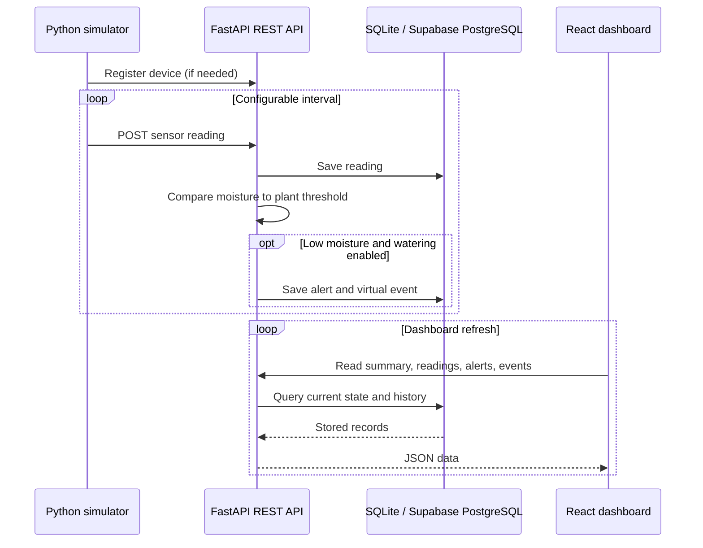

# Project Report: Cloud-Connected Smart Plant Care & Watering System

## Abstract

This project demonstrates a small IoT-to-cloud platform for monitoring plant conditions and evaluating irrigation needs. A Python sensor simulator provides repeatable synthetic readings in lieu of hardware. A FastAPI REST service validates and stores those readings, evaluates configurable soil-moisture thresholds, records alerts and virtual watering events, and supplies data to a responsive React dashboard. SQLite supports local development; Supabase-hosted PostgreSQL provides a managed cloud database option. Docker Compose runs the complete local system as separate services.

## 1. Problem statement

Manual plant watering is irregular and difficult to supervise remotely. Overwatering wastes water and can damage roots; underwatering can stress or kill plants. A connected monitoring workflow can make plant conditions observable, preserve a history, and notify a user when the soil moisture crosses a chosen limit.

## 2. Objectives

- Demonstrate cloud computing and IoT architecture without requiring physical devices.
- Generate realistic, time-stamped sensor values and transmit them through a REST API.
- Persist device metadata, readings, alerts, and irrigation events.
- Evaluate simple, explainable watering rules.
- Present current conditions and history through a remote dashboard.
- Offer local and cloud database deployment options with reproducible containers.
- Provide tests, documentation, and a repeatable GitHub portfolio artifact.

## 3. Scope and assumptions

All default readings and actuator actions are synthetic. The current irrigation feature records a virtual decision/event; it does not control a real pump. The API has no user/device authentication and must not be exposed publicly without an access-control layer. The Supabase option uses the managed PostgreSQL database through the backend; it does not send database credentials to the frontend.

## 4. Architecture and data flow



### Components

1. **Sensor simulator** — evolves synthetic moisture and ambient readings and sends JSON over HTTP; retries transient network errors.
2. **API service** — FastAPI routes expose device registration/update, sensor ingestion, summary, alert, and watering event operations. Pydantic validates payloads.
3. **Persistence** — SQLAlchemy maps four relational tables. SQLite is the no-setup local store; PostgreSQL is used for the cloud option.
4. **Decision logic** — incoming moisture is compared with each device’s configurable threshold; enabled low-moisture decisions are recorded with an alert.
5. **Dashboard** — React + TypeScript polls the API, displays metric cards and a Recharts history graph, and allows the user to change the threshold and record a virtual manual event.
6. **Deployment** — Docker Compose separates API, Nginx-served frontend, and simulator, with a persistent database volume and API health check.

## 5. Data model

| Entity | Principal fields | Purpose |
|---|---|---|
| `devices` | device ID, plant name/type, location, moisture threshold, watering enabled, creation time | Plant/device configuration |
| `sensor_readings` | device ID, moisture, temperature, humidity, light, timestamp | Time-series environmental history |
| `watering_events` | device ID, trigger type, moisture before/after, duration, timestamp | Simulated/manual irrigation record |
| `alerts` | device ID, alert type, message, status, creation time | Actionable notification history |

Database indexes support looking up readings, watering events, and alerts by device and time. Supabase SQL setup is available in `supabase/schema.sql`.

## 6. Watering and alert logic

For a device threshold `T` and current soil moisture `M`:

```text
watering_required = (M < T) AND device.watering_enabled
```

The decision is intentionally transparent and adjustable. A real system should add hysteresis, minimum soak intervals, pump run-time limits, tank-level checks, and sensor fault handling to avoid noisy or unsafe actuation. Alerts currently explain low-moisture readings; automated alert delivery (email/push/SMS) is an extension point.

## 7. Cloud computing concepts

| Concept | Where it appears |
|---|---|
| IoT-to-cloud | Simulated sensor clients communicate with the API over HTTP. |
| REST API / API service | FastAPI routes provide versioned JSON endpoints and OpenAPI docs. |
| Cloud database | Supabase managed PostgreSQL is configured behind the backend. |
| Serverless / PaaS concepts | The API can be deployed to a container app/PaaS; Supabase manages the database service. No serverless function is currently required. |
| Event-driven processing | Sensor submissions invoke threshold evaluation and generate event/alert records. |
| Time-series data | Sensor readings are timestamped and indexed by device/time. |
| Remote monitoring | Dashboard requests summary and history without being on the simulator host. |
| Scalability | API and simulator are separate containers; managed PostgreSQL can be used instead of local SQLite. |
| Availability | Health check and container restart policy assist operation; this demo does not claim high availability. |
| Observability | API health endpoint, simulator logs, and Docker logs expose basic operational state. |
| CI/CD | GitHub Actions runs backend tests and frontend production build on pushes and pull requests. |
| Secrets management | Cloud DB URL is held in a private environment variable, not bundled into the frontend. |

## 8. Technology stack

- Python 3.12+, FastAPI, Pydantic, SQLAlchemy
- SQLite locally; Supabase PostgreSQL optionally
- React 18, TypeScript, Vite, Recharts, Lucide
- Docker, Docker Compose, Nginx
- pytest and GitHub Actions

## 9. Verification plan

- Unit tests cover threshold boundary decisions and alert severity.
- Backend health and OpenAPI routes can be checked through `/api/v1/health` and `/docs`.
- Integration check: simulator registers a device and posts readings, then the dashboard shows readings, decisions, and events.
- Frontend build runs TypeScript checks and Vite production compilation.
- Docker check runs the services together and persists local database data in a named volume.

Run the tests using the commands in the repository README. Automated checks run from `.github/workflows/ci.yml`.

## 10. Deployment

The recommended demonstration is Docker Compose, which runs the API, React dashboard, and simulator locally. For cloud persistence, create a Supabase project, execute `supabase/schema.sql`, set a TLS-enabled `DATABASE_URL` in the deployment platform’s secret configuration, and set the exact frontend origin in `CORS_ORIGINS`. Deployment instructions and security caveats are in `docs/cloud-deployment.md`.

## 11. Limitations and future work

- Add Supabase Auth or another identity provider, ownership-aware authorization, and device credentials.
- Add time-series retention, pagination, alert acknowledgement, and notification integrations.
- Add MQTT ingestion for constrained devices and a queue for bursty sensor traffic.
- Move rule evaluation to a background worker/serverless event function if workloads grow.
- Improve simulator physics with explicit pump events and realistic moisture response.
- Add ESP32 integration, sensor calibration, electrical isolation, and actuator safety interlocks.
- Add integration/UI tests and observability metrics before a public deployment.

## 12. Conclusion

The project demonstrates a complete learning-scale data path from virtual IoT readings through a REST service and database to automation decisions and a dashboard. The local deployment requires no hardware or cloud account, while the Supabase and container paths demonstrate how the same design can be extended to managed cloud infrastructure.
